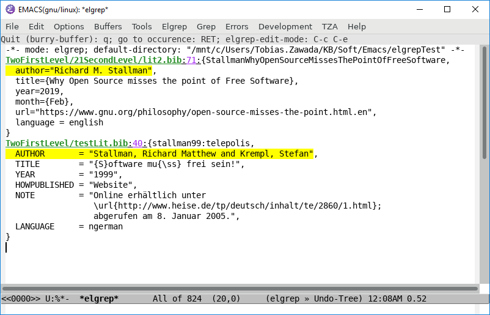

# Emacs-Lisp Grep (`elgrep`)

## Short description

Emacs lisp package for searching text matching a given regular expression in a set of files within a user-specified directory.
The files are selected by another regular expression matching the file names.
The directory can optionally be searched recursively.
PDF-files can also be searched but for that purpose the external tool `pdftotext` (or some equivalent program) is required.

## Installation

### Install via Melpa
Elgrep is available [via Melpa](https://melpa.org/#/elgrep). So you can just do `M-x package-install RET` and input `elgrep` as the package to be installed.

### Install from source
Save `elgrep.el` in one of the directories specified in the `load-path` of emacs and
put the following line into your initialization file (e.g., `~/.emacs`):

`(require 'elgrep)`

## Usage
### Simple Search
Open the `elgrep-menu` via menu item "Tools" → "Search files (Elgrep)...".
There are menu items for the directory, the file name regexp for filtering
and the regexp for grepping. Furthermore, you can also switch on recursive grep.

Run <kbd>M-x</kbd> `elgrep` to search a single directory for files with file
name matching a given regular expression for text matching a given
regular expression. With prefix arg <kbd>C-u</kbd> it searches the directory
recursively.
### Advanced Search
Elgrep can do much more for you than the simple search described in the previous section.

List of all menu items of `elgrep-menu`:

- **Expression**: You can change Expression from "regexp" to "List of regexps". In that list you can insert and delete entries.
  - Elgrep searches for all occurences of the first regexp in files/records that also have matches for the other entries.
  - You can negate the entries starting with the second one by putting a `!` in front of the entry. Files/records are only listed as search results if they do **not match the negated entries** in the list.
  - If you delete all entries of the list, i.e., the list is empty, elgrep looks for all files with matching file name (see below) and lists them in a dired buffer.
- **Directory**: Just the zero-level directory where the search starts
- **File Name Regular Expression**: Only files that match that regexp are searched.
- **Exclude File Name Regular Expression**: Files matching this regexp are not searched. This option is ignored if it is left empty. This option filters the names from the previous option.
- **Directory Name Regular Expression**: Step only into those directory that match this regexp.
- **Exclude Directory Name Regular Expression**: Don't step into those directories. This option filters the names from the previous option.
- **Recurse into subdirectories**: Just a toggle for activating recursive search.
- **Run asynchronously (experimental)**: You can choose from one of the following modes:
  - Separate Emacs instances: Uses the `async` package to run `elgrep` in another Emacs instance. This mode is quite a while in now. It works well for simple recursive searches. When doing advanced searches problems may occur with missing packages that you need for your user-defined functions. Note that the `Start elgrep` button changes to a `Stop elgrep` button.
  - Separate thread: Elgrep can run in a separate thread of the same Emacs. Threading is still in a very early phase in Emacs. Elgrep tries to give you control via `thread-yield` in all of its major loops. So if you type some key you can expect that Emacs reacts on that key during the search. But, the response is **very** sluggy!
  - Synchronous: That is the safest but also the inconvenient mode. It freezes Emacs as long as it searches for all matches. Sometimes that may take a while. You can interrupt that search by Quit (<kbd>C-g</kbd>) but then you do not get search results.
- **Minimal recursion depth**: The specified Directory (see above) is recursion level 0. Here you can instruct Elgrep to only search subdirectories with a given minimal depths below level 0.
- **Maximal recursion depth**: Here you can limit the maximal recursion depth. See the previous option.
- **Beginning of Record**: You can delimit the search to parts of files which we call **records**. The beginning and the end of the records can be defined by regular expressions or by Elisp functions. The buffer is narrowed to the record during the expression search.  
  Elgrep can sequentially search multiple records in one file. So you can built up simple queries textual databases with Elgrep.  
  The default setting is the function `point-min` for the beginning of the record and `point-max` for the end of the record. That means that the whole file is one record. With that default setting Elgrep works like the usual grep command finding all occurences of the Expression in the file.  
  In general the functions given as beginning and end of a record is called without arguments and should return buffer positions. The end position must be at or behind the beginning position. The search for the beginning of the next record starts at the end of the current one.  
  An example for useful regular expressions are for the record beginning the empty string matching the line beginning `^` and for the record end the regular expression matching the empty string at the line end `$`. With this combination each line of the file is one record. (Note, that empty lines are empty records.) That makes especially sense if the search expression is a list of regular expressions where one record must fulfill multiple requirements. For an instance one string must occur on a matching line but another string may not occur on that line.
- **End of Record**: See previous item.
- **Context Lines Before the Match**: While the record delimiters bound the search the context lines determine how many lines before and after the match are output in the `<*elgrep*>` result buffer. The input can be a number, a regexp, or a function:
  - Number: Output that many lines before the match. The default value 0 limits the output of to the line with the match.
  - Regular expression: Elgrep searches backward starting at the Expression match. It starts the output at the line with the match for the beginning of the context.
  - Function: That function is called with no arguments and should put point on the line starting the context.
- **Case Sensitivity**: Determines whether the expression search is case sensitive. The default setting takes the value of the variable `case-fold-search`.
- **Buffer Initialization**: Before the expression search starts the file contents is load into a buffer `< *elgrep-search*>`. By default the buffer contents is treated as simple text without special text syntax and properties. If you use syntax dependent functions like `forward-sexp` you should probably initialize the buffer with the syntax table for the file type or even with a full major-mode initialization.
- **File Predicate Function**: Predicate function called with the absolute file path as argument. The function should return non-nil if that file should be searched.
- **Search Function**: Function to search forward for occurences of the expression (maybe a regexp or a list of regexps) called with the same arguments as `re-search-forward`. On a positive match it should place point and set the match data like `re-search-forward` does. Thereby it is not required that RE is a regular expression. It defaults to `re-search-forward'.

### Examples

#### Searching a BibTeX database

The library [cexp](https://github.com/TobiasZawada/cexp/blob/master/cexp.el) for searching Combined EXPressions composed of regular expressions and balanced expressions works well together with Elgrep.

The [github directory of Elgrep](https://github.com/TobiasZawada/elgrep) contains a directory [elgrepTest](https://github.com/TobiasZawada/elgrep/elgrepTest) with bibtex files in subdirectories.

To search the bibtex files for publications by Stallman that do not contain `emacs` in the title use the following settings:
```
Expression: List of regexps:
[INS] [DEL] Regexp: ^ *author *= *\!(\<stallman\>\!)
[INS] [DEL] Regexp: !^ *title *= *\!(\<emacs\>\!)
Directory: ~/KB/Soft/Emacs/elgrepTest
File Name Regular Expression: \.bib\'
Recurse into subdirectories [X]
Run asynchronously (experimental): ( ) Separate instance of Emacs	(*) Separate thread	( ) Synchronous
Beginning of Record: Regexp: ^@[[:alpha:]]+
End of Record: Function: elgrep/forward-sexp
Context Lines Before The Match: Function: elgrep/point-min
Context Lines After The Match: Function: elgrep/point-max
Buffer initialization: [Options] Set syntax table
Search function: cexp-search-forward
```
The Elgrep search returns an `<*elgrep*>` buffer with the following contents:
```
-*- mode: elgrep; default-directory: "/mnt/c/Users/Tobias.Zawada/KB/Soft/Emacs/elgrepTest" -*-
TwoFirstLevel/21SecondLevel/lit2.bib:71:{StallmanWhyOpenSourceMissesThePointOfFreeSoftware,
  author="Richard M. Stallman",
  title={Why Open Source misses the point of Free Software},
  year=2019,
  month={Feb},
  url="https://www.gnu.org/philosophy/open-source-misses-the-point.html.en",
  language = english
}
TwoFirstLevel/testLit.bib:40:{stallman99:telepolis,
  AUTHOR       = "Stallman, Richard Matthew and Krempl, Stefan",
  TITLE        = "{S}oftware mu{\ss} frei sein!",
  YEAR         = "1999",
  HOWPUBLISHED = "Website",
  NOTE         = "Online erhältlich unter
                  \url{http://www.heise.de/tp/deutsch/inhalt/te/2860/1.html};
                  abgerufen am 8. Januar 2005.",
  LANGUAGE     = ngerman
}
```
The result of the Elgrep search as an image:


